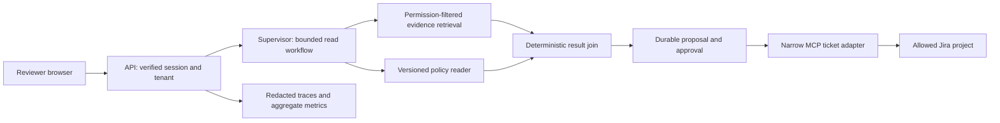

# Client delivery pack: AuditMesh

All company names, workloads, timings and costs below are synthetic planning inputs.
They are examples to replace during discovery, not observed results or promises.
This pack covers AUDIT-01, AUDIT-02, AUDIT-07 and FDE-09. It does not close the
AuditMesh application, MCP, UI or dashboard implementation tasks.

## Discovery record

Project: read-only compliance evidence review with human-approved ticket proposals.
Business owner: nominated compliance lead. Technical owner: nominated platform lead.
Security approver: nominated security reviewer. Acceptance authority: business owner.
Record actual names in the client's private workspace, not this public repository.

Ask the business owner to demonstrate one recent case from receipt to closure.
Capture the following answers before estimating delivery:

| Question | Synthetic worked answer | Evidence to obtain |
| --- | --- | --- |
| What starts a case? | A weekly control review request | Redacted request and process owner |
| Which system is authoritative? | Policy repository and signed evidence store | Source inventory, ACL/export contract |
| Which action is costly to reverse? | Creating and routing an external ticket | Ticketing policy and approver role |
| How many cases occur? | 200/month, peak 10 concurrently | Four weeks of actual arrival counts |
| What must never leave the network? | Restricted employee identifiers | Approved classification matrix |
| What is a correct result? | Supported gap or explicit insufficient evidence | Adjudicated examples and reviewer rubric |
| Who supports it after handoff? | Platform on-call; compliance owns decisions | Rota, escalation and acceptance signoff |

Unknowns register: authentication provider, connector scopes, data residency,
retention period, model approval, budget and source deletion notification method.
Each unknown needs an owner and resolution date before production approval.

## Five-step process and bottleneck

| Step | Owner | Handling minutes | Waiting minutes | Output |
| --- | --- | ---: | ---: | --- |
| Gather evidence | Analyst | 12 | 5 | Versioned evidence set |
| Map controls | Analyst | 8 | 0 | Control/source mapping |
| Assess gaps | Specialist | 10 | 15 | Proposed findings |
| Approve decision | Compliance lead | 5 | 180 | Approved or rejected exact proposal |
| Create ticket/report | Operator | 4 | 2 | Ticket reference and audit record |

Synthetic totals: 39 handling minutes, 202 waiting minutes, 241 elapsed minutes
for this serial case. Approval waiting is 180/241, about 75% of elapsed time.
Removing five seconds from a model call will not remove that queue.

Proposed experiment: designate an alternate reviewer and two scheduled review
windows. Compare waiting-time distributions before/after, adjusting for workload
and case complexity. Do not auto-approve to improve a latency chart. Parallel
evidence collection can reduce machine work, but the join must retain missing work.

## Scope and acceptance contract

MVP includes one approved corpus, one policy version source, two roles, evidence
citations, deterministic gap checks and a human-approved draft for one Jira project.
It excludes legal determinations, unrestricted web search, autonomous remediation,
arbitrary SQL, cross-client sharing and silent model/provider changes.

Data classes: public examples may use approved external APIs; internal policies
need an approved processing location; confidential evidence requires explicit model
and retention approval; restricted identifiers are excluded from this MVP.
The client data owner decides classification. Redaction is not declassification.

Requirements:

- R1: derive tenant/role from verified identity, never request JSON.
- R2: retrieve only permitted source versions before any model/reranker exposure.
- R3: every finding cites source ID/version/location or says evidence is missing.
- R4: approve exact destination, fields, source versions and payload hash.
- R5: retries reuse an operation ID; uncertain ticket creation requires reconciliation.
- R6: revocation, expiry and kill switch prevent new effects.
- R7: release evidence includes denial, timeout, conflict, restart and duplicate tests.

## HLD



Proposed topology: API/workers in private application subnets; database in private
data subnets; TLS ingress through the organization's gateway; approved provider
egress through controlled endpoints/proxy. On-premises deployment substitutes an
approved local model endpoint and private registry. Confirm network feasibility
before committing to either topology. No topology has been deployed here.

Trust boundaries: browser to API; source connectors to retrieval store; application
to model provider; MCP host/client to server; ticket adapter to Jira. Each boundary
needs identity, scoped permissions, time limits and redacted audit events.

## LLD and API/data contracts

| Route | Contract | Failure |
| --- | --- | --- |
| POST /reviews | source_set_id, immutable revision; idempotency key | 401/403 identity/scope, 409 changed intent |
| GET /reviews/{id} | state, evidence versions, missing-work list | 404 for absent or out-of-scope ID |
| POST /reviews/{id}/decision | explicit boolean, payload_hash, version | 409 changed/already-conflicting decision, 410 expiry |
| GET /operations/{id} | pending/claimed/succeeded/uncertain/rejected | 404 outside tenant |

Validate bounded strings and enums; reject unknown writable fields. Provide
OpenAPI examples for each status and review consumer compatibility before release.
This contract is a design artifact; routes are not claimed implemented by this pack.

Entities: Review(tenant,id,state,schema_version); Evidence(tenant,source,version,ACL);
Proposal(review_id,payload_hash,destination,expires); Decision(proposal_id,actor,
decision,time); Operation(tenant,operation_id,payload_hash,status,external_id);
AuditEvent(operation_id,event_type,time,trace_id). Use unique tenant/operation IDs.
Keep decision history append-only; changes create a new proposal version.

```mermaid
sequenceDiagram
  participant API
  participant DB
  participant Jira
  API->>DB: Claim approved exact operation
  DB-->>API: operation_id and payload hash
  API->>Jira: Create with correlation marker
  Jira--xAPI: Response lost after possible success
  API->>DB: Mark outcome uncertain
  API->>Jira: Reconcile by stable operation marker
  alt exactly one matching ticket
    API->>DB: Store external_id; succeeded
  else absent or ambiguous
    API->>DB: Keep uncertain; operator review
  end
```

The diagram intentionally does not retry create after an ambiguous result. If Jira
search visibility is delayed, absence is insufficient evidence of failure.

## ADR example

Decision: use a fixed review flow with bounded specialist reads and human approval.
Context: five known steps; wrong external routing is costly; evidence can be missing.
Rejected: unrestricted agent, because it widens actions and the evaluation space.
Rejected: one model call that both judges and creates, because it joins reasoning
and authorization without an independent decision boundary.
Cost accepted: more explicit states, an approval queue, and slower completion than
autonomous creation. Revisit only after measured demand and a reviewed control plan.
Owner/date/status: to be filled by the actual design review.

## Service targets and cost contract

Synthetic target, not an SLA promise: machine-phase p95 <= 8 seconds in a 28-day
window at <= 10 concurrent reviews and <= 8 evidence items per review. Measure at
API acceptance through proposal persistence. Human waiting is a separate metric
from proposal-ready to valid decision. Do not silently remove timeout/error cases:
report success coverage alongside latency, with failed requests counted in availability.

Illustrative machine budget: auth/admission 0.3 s; parallel retrieval/policy 1.5 s;
model attempts 4.0 s; join/persist 0.7 s; margin 1.5 s. These allocations total 8 s
but do not mathematically guarantee p95. Measure the full request distribution.
External ticketing is a separate asynchronous phase with its own deadline.

Availability objective to negotiate: 99.5% successful eligible machine requests
per 28-day window. Define eligibility and planned maintenance before measurement;
do not exclude provider outages to improve the result. Budget exhaustion yields a
visible deferred/review outcome, never unbounded retries.

Synthetic cost ceiling: 0.05 currency units per accepted review attempt and 300 per
month for the pilot. Reserve per-task spend before admission. Count retries,
unsuccessful model calls, embeddings, gateway, compute/storage and human handling.
Use versioned provider rate tables; missing usage is unknown cost, not zero.

Breach response: operator inspects failure slice/trace; disable optional expensive
paths or pause new work; preserve approvals and uncertain operations; notify owner;
restore a known evaluated version only after checking schema compatibility.
Alert delivery and enforcement are different controls and both need tests.

## SOW and ROI worksheet

Deliverables: approved discovery record, architecture/threat model, one bounded
integration, synthetic/approved evaluation set, tests, deployment recipe, UAT and
handoff. Dependencies: source access, identity registration, approved model contract,
infrastructure owner and named acceptance authority. Estimate effort only after
these are resolved. Changes to sources, roles, actions or residency require review.

Payment/milestone/legal terms must be agreed outside this technical template.
Acceptance is evidence against R1–R7, not an assurance of regulatory compliance.

Synthetic ROI example: 200 cases/month × 15 minutes of saved handling / 60 × 40
currency units/hour = 2,000 gross units/month at full adoption. At 50% adoption,
gross benefit is 1,000. Subtract 300 operations and 200 support units: 500 net.
This excludes implementation/change costs. At 25% adoption, the same assumptions
produce zero net benefit. Measure saved handling time; do not count waiting-time
reduction as labor saved without evidence.

## UAT evidence template

| Case | Expected | Actual / evidence | Reviewer / status |
| --- | --- | --- | --- |
| Allowed supported question | Correct source/version citations | Not run | Unassigned |
| Other tenant's source | No source/model/cache exposure | Not run | Unassigned |
| Missing policy worker | Incomplete review, no effect | Not run | Unassigned |
| Changed payload after approval | Reject stale decision | Not run | Unassigned |
| Lost Jira response | Uncertain; reconcile, no blind retry | Not run | Unassigned |
| Restart after local checkpoint | Recover authorized pending state | Not run | Unassigned |
| Revoked reviewer session | Decision/resume denied | Not run | Unassigned |
| Kill switch during queue backlog | No new effects after switch check | Not run | Unassigned |

Capture build digest, configuration versions, input-fixture ID, timestamps,
expected/actual result and redacted trace ID. A screenshot alone does not prove
absence of data leakage. Critical failures block signoff; no waivers by developers
without the named risk owner.

## Operations and training handoff

Release checklist: approved artifact digest; migration compatibility; evaluated
versions; identity/secret readiness; backup/restore evidence; rollback owner;
dashboards/alerts; denied-access checks; final permission to deploy.

Ownership table to fill: API/platform on-call; data owner; identity admin; model
gateway owner; compliance approver; ticketing admin. Record escalation channel,
business hours and backup contact in the private runbook. Do not invent coverage.

Incident steps: stop new effects; preserve operation IDs and safe evidence; scope
tenant/data exposure; revoke affected sessions/credentials; reconcile uncertain
operations; restore service only after owner approval. Avoid logging raw prompts,
PII or credentials during debugging. Follow the organization's incident obligations.

Restore drill: choose an approved backup; restore into an isolated environment;
verify tenant boundaries and counts; replay only read-safe work; compare ledger with
external ticket IDs before enabling effects. Measure recovery time and data loss.
No RTO/RPO claim is valid until the drill is performed.

Training session: operator finds a failed worker; reviewer rejects a changed payload;
identity admin revokes a session; ticketing owner reconciles an uncertain create;
platform owner activates/reverts the kill switch. Each person demonstrates their
step and records unresolved questions. Instructor demonstration alone is not handoff.

Retention worksheet: classify checkpoints, evidence, decisions, logs, model traces,
backups and exported evaluation cases; assign purpose, owner, duration, deletion
mechanism and verification. Exact durations require the client's policy decision.

Interview rehearsal: explain the slowest queue, one rejected architecture option,
one failure sequence, and what evidence is still missing. Do not describe this
synthetic case as professional delivery experience.
